# Laporan Proyek Machine Learning
### Nama  : Aloysius Manuel Bayu Krisnamurti
### Nim   : 211351012
### Kelas : TIF Malam A

## Domain Proyek

Proyek ini bertujuan untuk menganalisis data belanja pelanggan dengan tujuan meningkatkan pengalaman pelanggan, memahami perilaku pembelian, dan mengoptimalkan strategi pemasaran. Data belanja pelanggan mencakup informasi tentang pembelian, preferensi produk, frekuensi pembelian, dan interaksi dengan platform belanja. Dengan menganalisis data ini, proyek ini akan memberikan wawasan yang berharga untuk mengambil keputusan yang lebih cerdas dalam hal stok produk, promosi, dan pelayanan pelanggan.

## Business Understanding

Proyek analisis data belanja pelanggan bertujuan untuk memberikan wawasan mendalam tentang perilaku pembelian pelanggan dan mendukung pengambilan keputusan yang lebih cerdas dalam konteks peningkatan pengalaman pelanggan, strategi pemasaran yang lebih efektif, dan optimalisasi operasional bisnis.
Bagian laporan ini mencakup :

### Problem Statements

Menjelaskan pernyataan masalah latar belakang:
- Pernyataan Masalah 1: Bagaimana kita dapat mengidentifikasi dengan akurat preferensi produk pelanggan berdasarkan data belanja, sehingga merancang strategi pemasaran yang lebih cermat dan menarik ?
- Pernyataan Masalah 2: Apa faktor-faktor utama yang memiliki dampak signifikan pada keputusan pembelian pelanggan, dan bagaimana kita dapat memanfaatkannya dalam merancang strategi pemasaran yang lebih efektif ?
- Pernyataan Masalah 3: Bagaimana kita dapat meningkatkan personalisasi layanan berdasarkan data belanja pelanggan untuk menciptakan pengalaman pelanggan yang lebih positif dan memuaskan ?

### Goals

Menjelaskan tujuan dari pernyataan masalah:
- Jawaban pernyataan masalah 1: Mengembangkan model prediktif yang dapat mengidentifikasi dengan akurat preferensi produk setiap pelanggan berdasarkan data belanja.
- Jawaban pernyataan masalah 2: Mengoptimalkan strategi pemasaran dengan memahami faktor-faktor utama yang memengaruhi keputusan pembelian pelanggan.
- Jawaban pernyataan masalah 3: Meningkatkan tingkat personalisasi layanan berdasarkan data belanja pelanggan untuk menciptakan pengalaman pelanggan yang lebih positif.

### Solution statements
- Kami akan menggunakan algoritma analisis klaster untuk mengelompokkan data berdasarkan variabel atau feature.
- Kami akan mengevaluasi model dengan LabelEncoder 

## Data Understanding
Data yang digunakan dalam proyek ini adalah [Shop Customer Dataset]([https://www.kaggle.com/datasets/datascientistanna/customers-dataset/data]).

#### Variabel-variabel pada Body Fat Prediction Dataset adalah sebagai berikut:
-CustomerID = ('ID Custemer') (object) ID yang ditetapkan untuk setiap pelanggan. 

-Gender = ('Jenis Kelamin') (int64) Jenis kelamin pelanggan (misalnya, Pria, Wanita)

-Age = ('Umur') (int64) Usia pelanggan.

-Annual Income ($) = ('Pendapatan Tahunan') (int64) Pendapatan tahunan pelanggan.

-Spending Score = ('Skor Pengeluaran') (int64) Skor yang menunjukkan perilaku belanja pelanggan.

-Profession = ('Pekerjaan Pelanggan') (object) Profesi atau pekerjaan pelanggan.

-Work Experience = ('Pengalaman Kerja') (int64) Jumlah tahun pengalaman kerja.

-Family Size = ('Ukuran Keluarga') (int64) Ukuran keluarga pelanggan.

## Data Preparation

#### Data Collection
Merupakan data yang saya dapatkan dari website kaggle dengen nama Shop Customer Dataset, jika tertarik bisa klik link nya di Data Understanding

#### Data Discovery And Profiling
Untuk bagian ini, kita menggunakan teknik EDA. Pertama kita mengimport semua library yang dibutuhkan,

`import numpy as np`

`import pandas as pd`

`import matplotlib.pyplot as plt`

`import seaborn as sns`

`import plotly.express as px`

`from sklearn.preprocessing import StandardScaler, LabelEncoder, OneHotEncoder`

`from sklearn.cluster import KMeans`

`from sklearn.decomposition import PCA`

`import pickle`

`import warnings`
`warnings.filterwarnings("ignore")`

Mari kita lanjutkan dengan memasukkan file csv yang telah di extract pada sebuah variable 

`df = pd.read_csv("customer/Customers.csv")`

Untuk melihat kolom kita masukkan untuk mengetahui CustomerID, dll

`df.head()`

Selanjutnya  kita masukkan seperti dibawah

`df.set_index('CustomerID', inplace=True)`

Untuk mengetahui deskripsi kita gunakan perintah dibawah

`df.describe()`

Masukkan info untuk mengetahui integernya

`df.info()`

Masukkan isnull untuk mengetahui tipe datanya 

`df.isnull().sum()`

Selanjutya masukkan dropna untuk menghapus data yang tidak kepakai

`df.dropna(inplace=True)`

Masukkan unique untuk mengetahui angka yang unik

`df["Age"].unique()`

Selanjutnya masukkan seperti dibawah

`df = df[df["Age"]>18]`

Masukkan untuk mengganti namanya

`columns_to_update = {`

    `'Annual Income ($)': 'Annual Income',`
    
    `'Spending Score (1-100)':` `'Spending Score'`
    
`}`

`df = df.rename(columns=columns_to_update)`

`df.head()`

Selanjutnya masukkan edanya

`numeric_cols = ['Age', 'Annual Income', 'Spending Score', 'Work Experience', 'Family Size']`

`df_numeric = df[numeric_cols]`

`fig, axes = plt.subplots(nrows=len(numeric_cols), figsize=(8, 20))`

`plt.subplots_adjust(hspace=0.5)`

`for i, col in enumerate(numeric_cols):`

    `sns.histplot(data=df_numeric,` `x=col, bins=30, kde=True, ax=axes[i])`
    
    `axes[i].set_title(f'Distribution of {col}')`

`plt.suptitle('Distribution of Numeric Columns', y=0.95)`

`plt.show()`

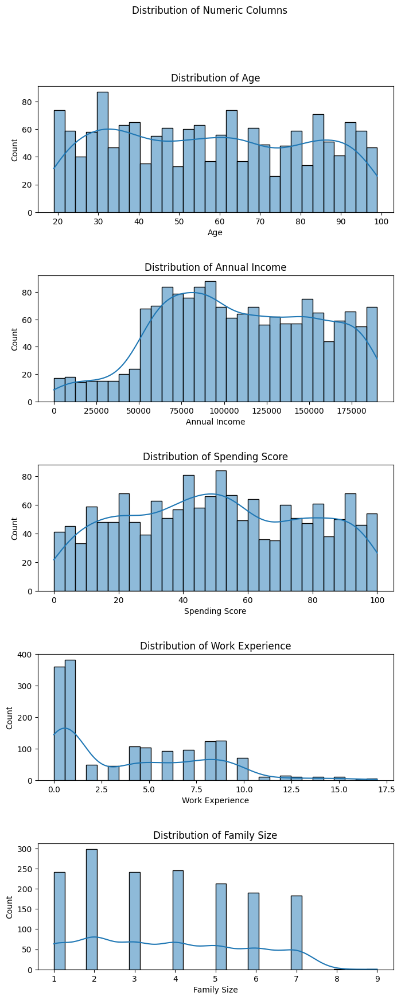

Selanjutnya masukkan correlation matrix

`numeric_cols = df.select_dtypes(include='number')`

`correlation_matrix = numeric_cols.corr()`

`plt.figure(figsize=(10, 8))`

`sns.heatmap(correlation_matrix, annot=True, cmap='coolwarm', fmt=".2f", linewidths=.5)`

`plt.title('Correlation Matrix Heatmap')`

`plt.show()`

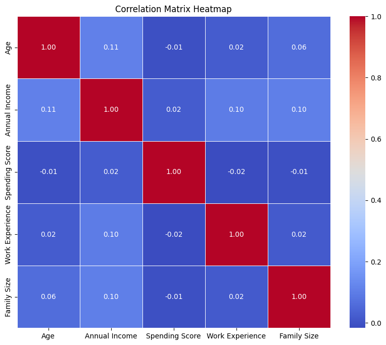

Untuk mengetahui gender proportion masukkan rumus ini

`gender_counts = df['Gender'].value_counts()`

`fig = px.pie(`

    `gender_counts,`
    
    `values=gender_counts,`
    
    `names=gender_counts.index,`
    
    `labels={'index': 'Gender',` `'values': 'Count'},`
    
    `title='Gender Proportion',`
    
    `color=gender_counts.index,`
    
    `color_discrete_map={'Male':` `'lightblue', 'Female':` `'lightcoral'},`
    
`)`

`fig.update_traces(textinfo='percent+label', pull=[0.1, 0])`

`fig.show()`

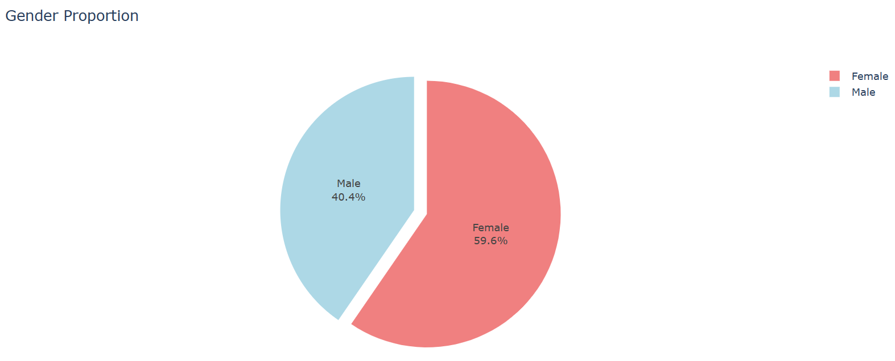

Perbandingan pemasukan dan pengeluaaran

`fig = px.scatter(df, x='Annual Income', y='Spending Score', color='Gender',`

                 `title='Income vs Spending Score',`
                 
                 `labels={'Annual Income': 'Annual Income', 'Spending Score': 'Spending Score', 'Gender': 'Gender'})`
                 
`fig.show()`

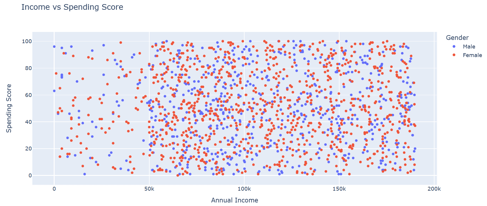

Perbandingan pengeluaran score by umur grup

`df['Age Group'] = pd.cut(df['Age'], bins=[0, 20, 30, 40, 50, 60, float('inf')],`

                         `labels=['0-20', '21-30', '31-40', '41-50', '51-60', '60+'])`
                         
`fig = px.box(df, x='Age Group', y='Spending Score', color='Gender',`

             `title='Spending Score by Age Group',`
             
             `labels={'Age Group': 'Age Group', 'Spending Score': 'Spending Score', 'Gender': 'Gender'})`
             
`fig.show()`

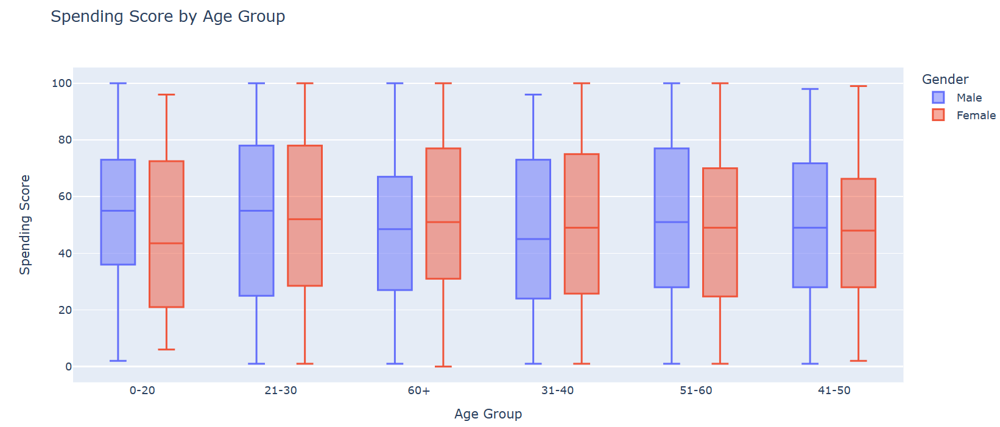

Perbandingan pengeluaran score distribusi by pekerjaan

`fig = px.violin(df, x='Profession', y='Spending Score', color='Gender',`

                `title='Spending Score Distribution by Profession',`
                
                `labels={'Profession': 'Profession', 'Spending Score': 'Spending Score', 'Gender': 'Gender'})`
                
`fig.show()`

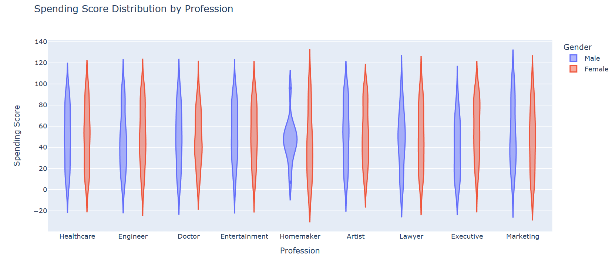

Perbandingan pengalaman kerja dan pengeluaran score

`fig = px.scatter(df, x='Work Experience', y='Spending Score', color='Gender',`

                 `title='Work Experience vs Spending Score',`
                 
                 `labels={'Work Experience': 'Work Experience', 'Spending Score': 'Spending Score', 'Gender': 'Gender'})`
                 
`fig.show()`

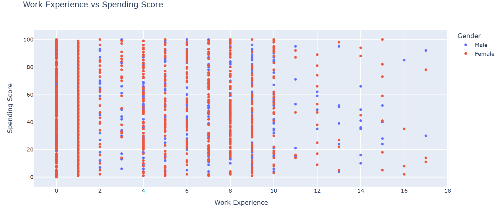

Selanjutnya perbandingan rata-rata pengeluaran score by pengalaman kerja

`avg_spending_by_experience = df.groupby('Work Experience')['Spending Score'].mean().reset_index()`

`fig = px.line(avg_spending_by_experience, x='Work Experience', y='Spending Score',`

              `title='Average Spending Score by Work Experience',`
              
              `labels={'Work Experience': 'Work Experience', 'Spending Score': 'Average Spending Score'})`
              
`fig.show()`

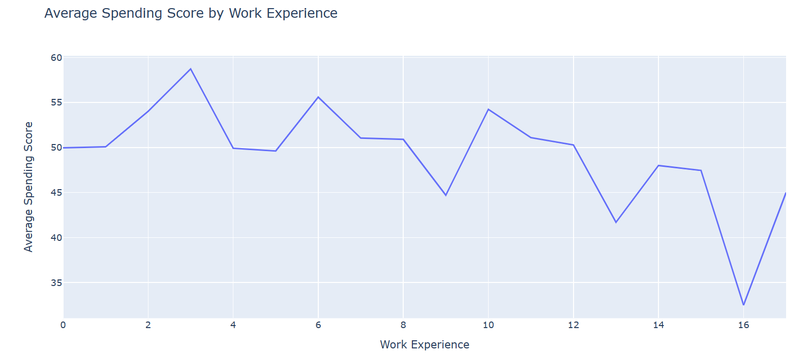

Perbandingan ukuran keluarga dan pemasukan pertahun

`fig = px.scatter(df, x='Family Size', y='Annual Income', color='Gender',`

                 `title='Family Size vs Annual Income',`
                 
                 `labels={'Family Size': 'Family Size', 'Annual Income': 'Annual Income', 'Gender': 'Gender'})`
                 
`fig.show()`

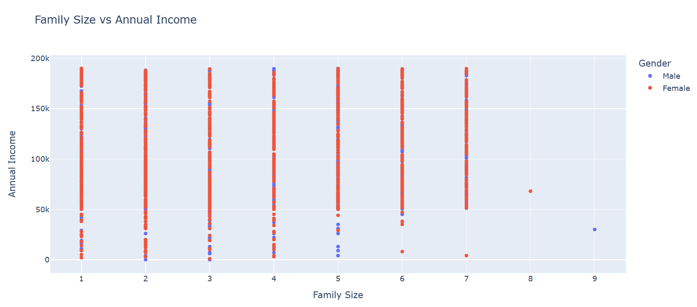

Perbandingan ukuran keluarga dan pengeluaran score

`fig = px.scatter(df, x='Family Size', y='Spending Score', color='Gender',`

                 `title='Family Size vs Spending Score',`
                 
                 `labels={'Family Size': 'Family Size', 'Spending Score': 'Spending Score', 'Gender': 'Gender'})`
                 
`fig.show()`

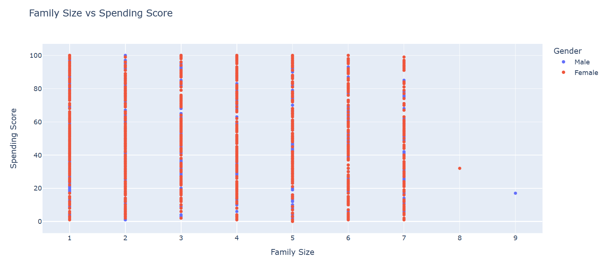

Perbandingan jenis kelamin distribusi bersama pekerjaan

`custom_colors = {'Male': 'red', 'Female': 'blue'}`

`fig = px.bar(df, x='Profession', color='Gender', barmode='group',`

    `title='Gender Distribution Within Professions', color_discrete_map=custom_colors,)`

`fig.show()`

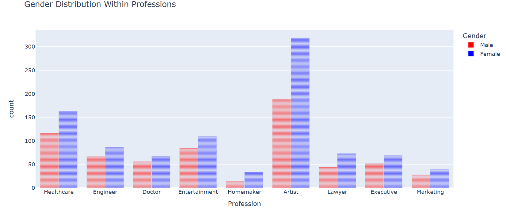

Rata-rata pengeluaran score

`average_spending_score = df['Spending Score'].mean()`

`print(f"Average Spending Score: {average_spending_score:.2f}")`

Distribusi pekerjaan

`profession_counts = df['Profession'].value_counts()`

`fig = px.bar(`
    `profession_counts,`
    
    `x=profession_counts,`
    
    `y=profession_counts.index,`
    
    `orientation='h',`
    
    `labels={'y': 'Profession', 'x': 'Count'},`
    
    `title='Distribution of Professions',`
    
`)`

`fig.show()`

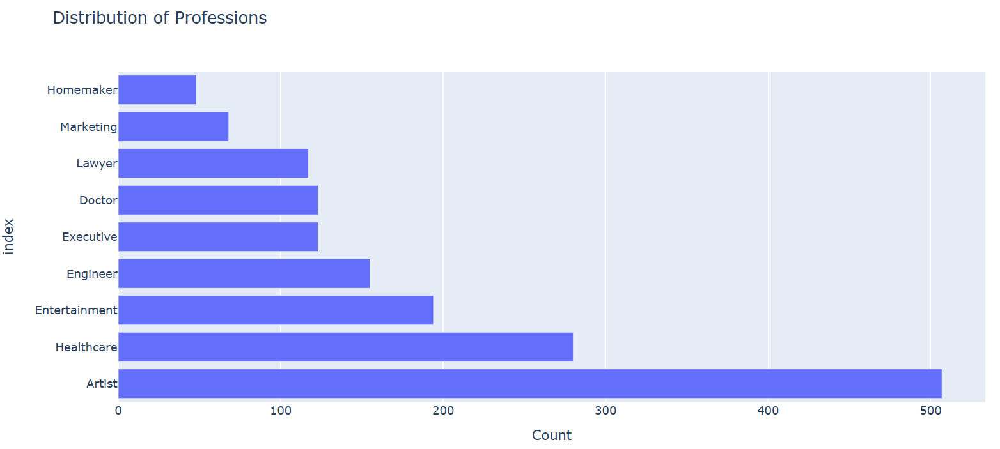

Pengeluaran score by pekerjaan

`fig = px.box(df, x='Profession', y='Spending Score', color='Gender',`

             `title='Spending Score by Profession',`
             
             `labels={'Profession': 'Profession', 'Spending Score': 'Spending Score', 'Gender': 'Gender'})`
             
`fig.show()`

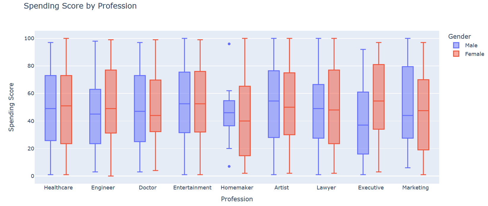

Masukkan ini untuk menargetkan umur

`high_spending_age_group = df[df['Spending Score'] > df['Spending Score'].mean()]['Age Group'].mode().iloc[0]`

`print(f"Targeting High-Spending Age Group: {high_spending_age_group}")`

Masukkan ini untuk target promosi umur

`gender_promotions = df.groupby('Gender')['Spending Score'].mean()`

`target_gender = gender_promotions.idxmax()`

`print(f"Targeting Promotions to Gender: {target_gender}")`

Selanjutnya masukkan label labelnya

`df['IncomePerMember'] = df['Annual Income'] / df['Family Size']`

`bins = [0, 20, 40, 60, 80, 100]`

`labels = ['Very Low', 'Low', 'Moderate', 'High', 'Very High']`

`df['SpendingScoreCategory'] = pd.cut(df['Spending Score'], bins=bins, labels=labels, right=False)`

`bins = [0, 5, 10, 15, 20]`

`labels = ['Entry', 'Mid', 'Senior', 'Expert']`

`df['ExperienceLevel'] = pd.cut(df['Work Experience'], bins=bins, labels=labels, right=False)`

`df['Income_Experience_Ratio'] = df['Annual Income'] / (1 + df['Work Experience'])`

`bins_family = [0, 3, 5, float('inf')]`

`labels_family = ['Small', 'Medium', 'Large']`

`df['FamilySizeCategory'] = pd.cut(df['Family Size'], bins=bins_family, labels=labels_family, right=False)`

Masukkan ini untuk melihat isinya

`df.head()`

Waduh, ternyata proses nya banyak dan mari kita lanjutkan

## Modeling
Sebelumnya mari kita masukkan label encodernya

`label_encoder = LabelEncoder()`

`df['Gender'] = label_encoder.fit_transform(df['Gender'])`

`df['Profession'] = label_encoder.fit_transform(df['Profession'])`

`df['Age Group'] = label_encoder.fit_transform(df['Age Group'])`

`df['SpendingScoreCategory'] = label_encoder.fit_transform(df['SpendingScoreCategory'])`

`df['ExperienceLevel'] = label_encoder.fit_transform(df['ExperienceLevel'])`

`df['FamilySizeCategory'] = label_encoder.fit_transform(df['FamilySizeCategory'])`

`numerical_cols = ['Work Experience', 'Family Size', 'IncomePerMember', 'Income_Experience_Ratio', 'Spending Score']`

`scaler = StandardScaler()`

`df[numerical_cols] = scaler.fit_transform(df[numerical_cols])`

Selanjutnya masukkan ini untuk melihat isinya lagi

`df.head()`

Sekarang kita masukkan metode kmeansnya

`wcss = []`

`for i in range(1,11):`

    `kmeans = KMeans(n_clusters = i, init = 'k-means++', random_state = 42)`
    
    `kmeans.fit(df)`
    
    `wcss.append(kmeans.inertia_)`

Sekarang untuk menampilkan kmeansnya

`plt.figure(figsize = (10,8))`

`plt.plot(range(1, 11), wcss, marker = 'o', linestyle = '--')`

`plt.xlabel('Number of Clusters')`

`plt.ylabel('WCSS')`

`plt.title('K-means Clustering')`

`plt.show()`

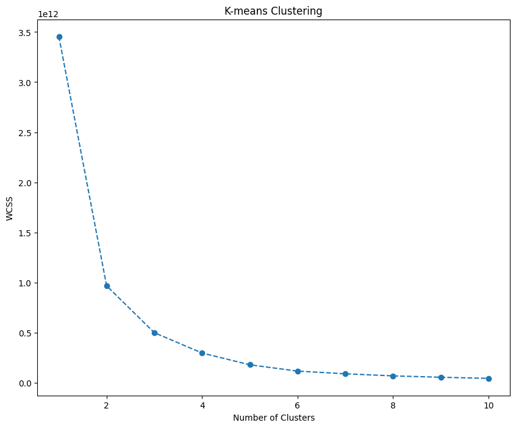

Untuk mengklusterkannya

`kmeans = KMeans(n_clusters = 3, init = 'k-means++', random_state = 42)`

`kmeans.fit(df)`

Masukan segmen kmeans untuk menganalisis

`df_segm_kmeans = df.copy()`

`df_segm_kmeans['Segment K-means'] = kmeans.labels_`

`df_segm_analysis = df_segm_kmeans.groupby(['Segment K-means']).mean()`

`df_segm_analysis`

`df_segm_analysis['N Obs'] = df_segm_kmeans[['Segment K-means','Gender']].groupby(['Segment K-means']).count()`

`df_segm_analysis['Prop Obs'] = df_segm_analysis['N Obs'] / df_segm_analysis['N Obs'].sum()`

`df_segm_analysis`

Masukan rename untuk mengganti namanya dari numerik

`df_segm_analysis.rename({0:'well-off',`

                         `2:'fewer-opportunities',`
                         
                         `1:'standard',})`

`df_segm_kmeans['Labels'] = df_segm_kmeans['Segment K-means'].map({0:'well-off',`

                         `2:'fewer-opportunities',`
                         
                         `1:'standard',})`

Masukan plot figure untuk menampilkannya

`x_axis = df_segm_kmeans['Age']`

`y_axis = df_segm_kmeans['Annual Income']`

`plt.figure(figsize=(10, 8))`

`sns.scatterplot(x=x_axis, y=y_axis, hue=df_segm_kmeans['Labels'], palette=['g', 'r', 'c', 'm'])`

`plt.title('Segmentation K-means')`

`plt.show()`

## Evaluation
Pada bagian ini saya menggunakan F1 score sebagai metrik evaluasi
- F1 Score: F1 score adalah rata-rata harmonis antara presisi dan recall. F1 score memberikan keseimbangan antara presisi dan recall. F1 score dihitung dengan menggunakan rumus sebagai berikut :

`from sklearn.linear_model import LinearRegression`

`lr = LinearRegression()`

`lr.fit(x_train,y_train)`

`predik = lr.predict(X_test)`

`y = lr.score(X_test, y_test)`

`print('Akurasi Model Regresi Linier : ', y)`

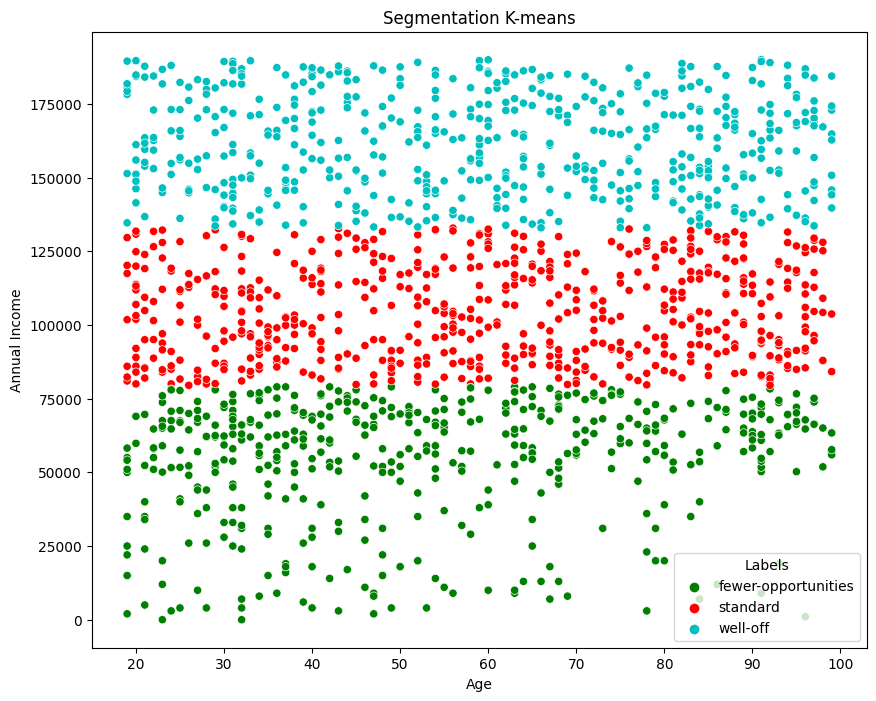

## Deployment
[My Cluster App](https://iyu5jqcpqexkumovjutpsp.streamlit.app/).

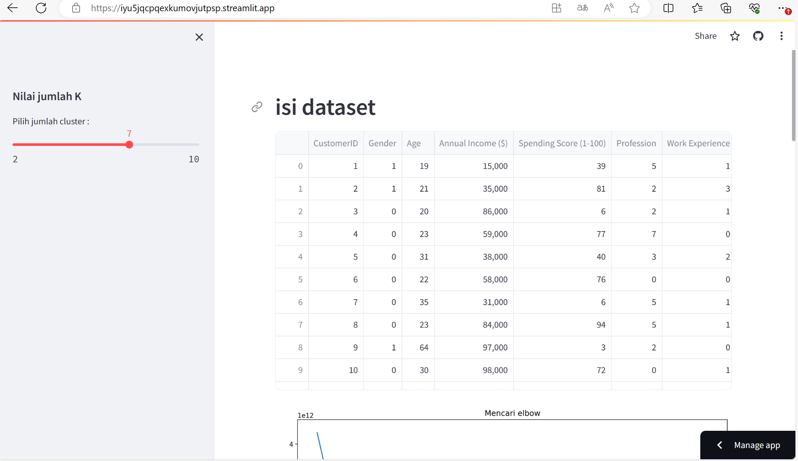
